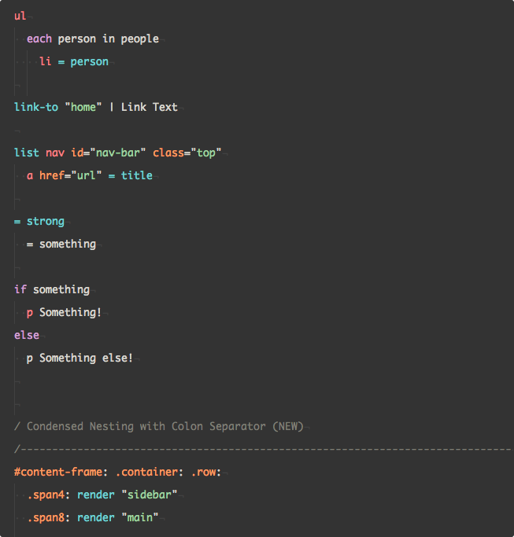

# atom-emblem package

[Emblem](http://emblemjs.com/) language for Atom

Originally converted from the [Sublime Text package](https://github.com/johanobergman/sublime-emblem-syntax) and adapted for Atom.
